# Spark Structured Streaming

the purpose of this activity is to learn how to use `Spark structured streaming` in `java` to 
performs `real-time processing` using Spark.
in this activity we use `Hospital incidents data`, and we try to:
- `count` number of incidents by `service`.
- show the `two years` when hospital has `more incidents.`


the incidents data stored in `csv` files, containing the following cols: 
`id | title | description | service | date`:

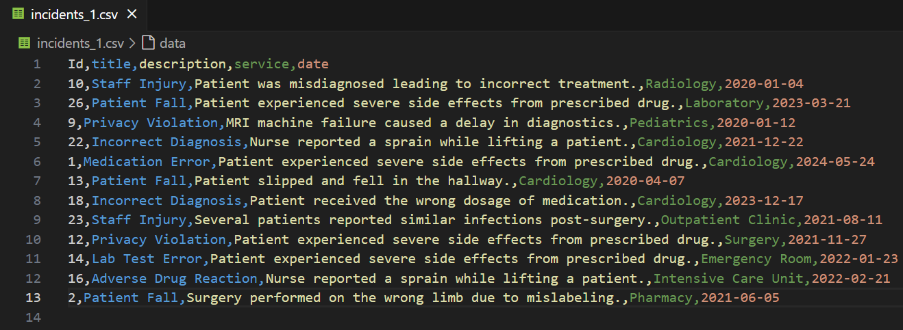

## IncidentAnalyser job

to create spark job, that can performs real-time processing using spark structured streaming in java, first
we create a java project with maven as build tool.

### Spark maven dependencies

we need the following maven dependencies:

```xml
<dependencies>
    <!-- https://mvnrepository.com/artifact/org.apache.spark/spark-core -->
    <dependency>
        <groupId>org.apache.spark</groupId>
        <artifactId>spark-core_2.13</artifactId>
        <version>3.5.3</version>
    </dependency>
    
    <!-- https://mvnrepository.com/artifact/org.apache.spark/spark-sql -->
    <dependency>
        <groupId>org.apache.spark</groupId>
        <artifactId>spark-sql_2.13</artifactId>
        <version>3.5.3</version>
    </dependency>

    <!--disable slf4j log implementation-->
    <dependency>
        <groupId>org.slf4j</groupId>
        <artifactId>slf4j-nop</artifactId>
        <version>1.7.32</version>
        <scope>runtime</scope>
    </dependency>
    
</dependencies>

```

### IncidentAnalyser class

our job will be simple class that have main method, where we define our `Streaming queries`:

```java
package md.hajji.incidents;

import org.apache.spark.sql.Dataset;
import org.apache.spark.sql.Row;
import org.apache.spark.sql.SparkSession;
import org.apache.spark.sql.streaming.OutputMode;
import org.apache.spark.sql.streaming.StreamingQuery;
import org.apache.spark.sql.streaming.StreamingQueryException;
import org.apache.spark.sql.types.*;
import java.util.concurrent.TimeoutException;
import static org.apache.spark.sql.functions.*;

public class IncidentAnalyser {

    private static final String APP_NAME = "IncidentAnalyser";
    private static final String SPARK_MASTER = "spark://spark-master:7077";
    private static final String FILES_LOCATION = "hdfs://namenode:8020/incidents";
    private static final String LOG_LEVEL = "WARN";

    /**
     * create spark session
     * @return : SparkSession instance
     */
    static SparkSession getSparkSession() {
        return SparkSession.builder()
                .appName(APP_NAME)
                .master(SPARK_MASTER)
                .getOrCreate();
    }

    /**
     * define incident schema
     * @return : StructType instance
     */
    static StructType getIncidentSchema() {
        return new StructType(
                new StructField[]{
                        new StructField("Id", DataTypes.IntegerType, false, Metadata.empty()),
                        new StructField("title", DataTypes.StringType, false, Metadata.empty()),
                        new StructField("description", DataTypes.StringType, false, Metadata.empty()),
                        new StructField("service", DataTypes.StringType, false, Metadata.empty()),
                        new StructField("date", DataTypes.DateType, false, Metadata.empty()),
                }
        );
    }

    public static void main(String[] args) {


        // initialize spark session
        try(SparkSession session = getSparkSession()){

            // set up logs level enable only  Warning logs:
            session.sparkContext().setLogLevel(LOG_LEVEL);

            // connect to incidents directory where incidents csv files are stored:
            Dataset<Row> incidents = session.readStream()
                    // define incident schema:
                    .schema(getIncidentSchema())
                    // tell spark that first row is the header:
                    .option("header", "true")
                    // load csv files from incidents directory location in HDFS:
                    .csv(FILES_LOCATION);


            // define the first query that count incidents by service:
            // group by service col:
            StreamingQuery countIncidentByService = incidents.groupBy(col("service"))
                     // use count aggregation func and rename count column:
                    .agg(count("*").alias("Number_incidents"))
                    // write the results in the output table:
                    .writeStream()
                    //set output mode to Complete so the entire query results will be
                    //persisted to the output:
                    .outputMode(OutputMode.Complete())
                    // we need to persist results in console:
                    .format("console")
                    // start the query:
                    .start();

            // define the second query that most 2 year when we have max incidents:
            StreamingQuery mostIncidentByYear = incidents
                    // group by year col parsed from date col:
                    // alias for rename column name in the output table:
                    .groupBy(year(col("date")).alias("Year_incidents"))
                    // apply count aggregation func:
                    .agg(count("*")
                            .alias("Number_incidents"))
                    // order results by number of incidents (desc order):
                    .orderBy(col("Number_incidents").desc())
                    // we need just 2 first years:
                    .limit(2)
                    // write the results in the output table with complete mode:
                    .writeStream()
                    .outputMode(OutputMode.Complete())
                    // the results will be persisted in the console:
                    .format("console")
                    .start();


            // await two queries to finish:
            countIncidentByService.awaitTermination();
            mostIncidentByYear.awaitTermination();


        } catch (TimeoutException | StreamingQueryException exception) {
            throw new RuntimeException(exception);
        }
    }
}

```

we need to generate `jar file` of our application, so `maven` can help us:

```shell
mvn clean package
```

or we can use our `IDE` to generate jar file.

## Execute IncidentAnalyser Job

we try to run `IncidentAnalyser job` in spark hdfs cluster deployed in `Docker` 
by the following `docker-compose.yml` file:

```yaml
services:
  # HDFS nodes:
  namenode:
    image: apache/hadoop:3.3.6
    container_name: namenode
    hostname: namenode
    command: ["hdfs", "namenode"]
    ports:
      - 9870:9870
    
    env_file:
      - ./config
    environment:
      ENSURE_NAMENODE_DIR: "/tmp/hadoop-root/dfs/name"
    volumes:
      - ./jars:/opt/hadoop/jars
      - ./shared:/opt/hadoop/shared
    networks:
      - spark-hdfs-net


  datanode:
    image: apache/hadoop:3.3.6
    command: ["hdfs", "datanode"]
    env_file:
      - ./config
    networks:
      - spark-hdfs-net


  resourcemanager:
    image: apache/hadoop:3.3.6
    hostname: resourcemanager
    container_name: resourcemanager
    command: ["yarn", "resourcemanager"]
    ports:
        - 8088:8088
    env_file:
      - ./config
    volumes:
      - ./test.sh:/opt/test.sh
    networks:
      - spark-hdfs-net

  nodemanager:
    image: apache/hadoop:3.3.6
    command: ["yarn", "nodemanager"]
    env_file:
      - ./config
    networks:
      - spark-hdfs-net
      
  
  # Spark nodes:

  spark-master:
    image: bitnami/spark:3.5.3-debian-12-r1
    container_name: spark-master
    hostname: spark-master
    environment:
      - SPARK_MODE=master
      - SPARK_MASTER_PORT=7077
      - SPARK_MASTER_WEBUI_PORT=8080
      - SPARK_DAEMON_MEMORY=1g 
    ports:
      - "7077:7077"
      - "8080:8080"
    volumes:
      - ./volumes/data:/data

    networks:
      - spark-hdfs-net


  spark-worker-1:
    image: bitnami/spark:3.5.3-debian-12-r1
    container_name: spark-worker-1
    environment:
      - SPARK_MODE=worker
      - SPARK_MASTER_URL=spark://spark-master:7077
      - SPARK_WORKER_MEMORY=1g  
      - SPARK_WORKER_WEBUI_PORT=4040
    depends_on:
      - spark-master
    volumes:
      - ./volumes/data:/data
    ports:
      - "4040:4040"  
    networks:
      - spark-hdfs-net

  spark-worker-2:
    image: bitnami/spark:3.5.3-debian-12-r1
    container_name: spark-worker-2
    environment:
      - SPARK_MODE=worker
      - SPARK_MASTER_URL=spark://spark-master:7077
      - SPARK_WORKER_MEMORY=1g 
      - SPARK_WORKER_WEBUI_PORT=4040
    depends_on:
      - spark-master
    volumes:
      - ./volumes/data:/data
    ports:
      - "4140:4040"  
    networks:
      - spark-hdfs-net


networks:
  spark-hdfs-net:
    driver: bridge

```

also we use a config file for `hdfs` services:

```properties
HADOOP_HOME=/opt/hadoop
CORE-SITE.XML_fs.default.name=hdfs://namenode
CORE-SITE.XML_fs.defaultFS=hdfs://namenode:8020

HDFS-SITE.XML_dfs.namenode.rpc-address=namenode:8020
HDFS-SITE.XML_dfs.replication=2

MAPRED-SITE.XML_mapreduce.framework.name=yarn
MAPRED-SITE.XML_yarn.app.mapreduce.am.env=HADOOP_MAPRED_HOME=$HADOOP_HOME
MAPRED-SITE.XML_mapreduce.map.env=HADOOP_MAPRED_HOME=$HADOOP_HOME
MAPRED-SITE.XML_mapreduce.reduce.env=HADOOP_MAPRED_HOME=$HADOOP_HOME
YARN-SITE.XML_yarn.resourcemanager.hostname=resourcemanager
YARN-SITE.XML_yarn.nodemanager.pmem-check-enabled=false
YARN-SITE.XML_yarn.nodemanager.delete.debug-delay-sec=600
YARN-SITE.XML_yarn.nodemanager.vmem-check-enabled=false
YARN-SITE.XML_yarn.nodemanager.aux-services=mapreduce_shuffle
CAPACITY-SCHEDULER.XML_yarn.scheduler.capacity.maximum-applications=10000
CAPACITY-SCHEDULER.XML_yarn.scheduler.capacity.maximum-am-resource-percent=0.1
CAPACITY-SCHEDULER.XML_yarn.scheduler.capacity.resource-calculator=org.apache.hadoop.yarn.util.resource.DefaultResourceCalculator
CAPACITY-SCHEDULER.XML_yarn.scheduler.capacity.root.queues=default
CAPACITY-SCHEDULER.XML_yarn.scheduler.capacity.root.default.capacity=100
CAPACITY-SCHEDULER.XML_yarn.scheduler.capacity.root.default.user-limit-factor=1
CAPACITY-SCHEDULER.XML_yarn.scheduler.capacity.root.default.maximum-capacity=100
CAPACITY-SCHEDULER.XML_yarn.scheduler.capacity.root.default.state=RUNNING
CAPACITY-SCHEDULER.XML_yarn.scheduler.capacity.root.default.acl_submit_applications=*
CAPACITY-SCHEDULER.XML_yarn.scheduler.capacity.root.default.acl_administer_queue=*
CAPACITY-SCHEDULER.XML_yarn.scheduler.capacity.node-locality-delay=40
CAPACITY-SCHEDULER.XML_yarn.scheduler.capacity.queue-mappings=
CAPACITY-SCHEDULER.XML_yarn.scheduler.capacity.queue-mappings-override.enable=false

```

### Start Spark-HDFS cluster

to start spark-hdfs cluster as described in `docker-compose.yml` file above, we use the following  command:

```shell
docker-compose up --scale datanode=2 -d
```

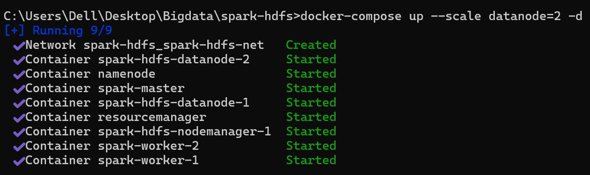


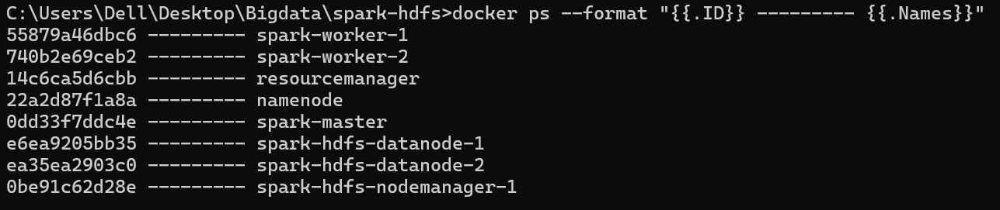


### Execute IncidentAnalyser job

before run `incidentAnalyser job`, we create `incidents` directory in `HDFS` root, because 
our job will listen to that dir and waiting for incident csv files, so we move inside
hdfs command line by:

```shell
docker exec -it <NAMENODE-CONTAINER-ID> bash
```

and then create `incidents` dir in the root:

```shell
hdfs dfs -mkdir /incidents
```


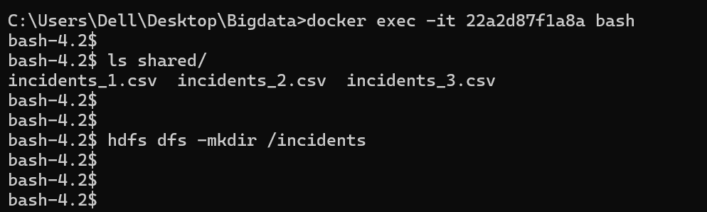


we need also to access to `spark-master` command line:

```shell
docker exec -it <SPAEK-MASTER-CONTAINER-ID> bash
```

we notice that we placed our application `jar file` within spark-master volume `/data` and we 
can check that our jar file is accessible by `spark-master`:

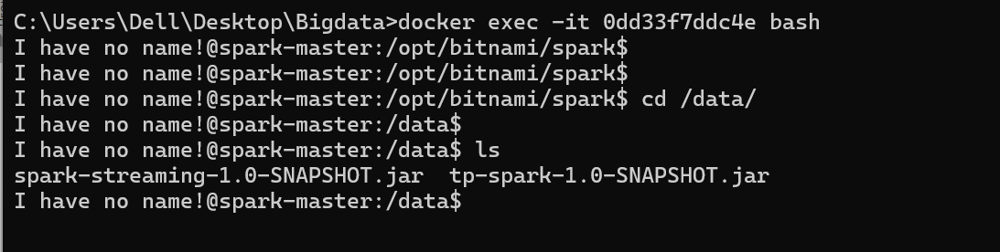

so, the next step is to start `incident analyser` job, by :

```shell
spark-submit \
--class md.hajji.incidents.IncidentAnalyser \
spark-streaming-1.0-SNAPSHOT.jar
```

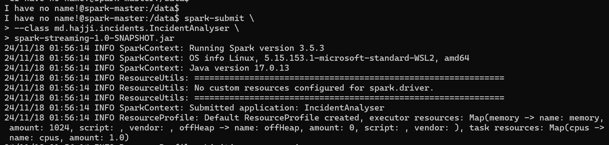


now our job is ready to receive incidents file as `csv` format, we 
notice that we are already prepare 3 incident files:
- `incident_1.csv`
- `incident_2.csv`
- `incident_3.csv`

and we placed them into `namenode volume` (in shared dir).

### Put incident_1.csv file within incidents dir

to put `incident_1.csv` within incidents HDFS dir we use the following command in `namenode` command line:

```shell
hdfs dfs -put ./shared/incident_1.csv /incidents
```

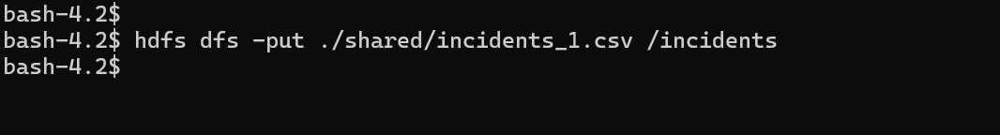

we got the following results from `spark-master console`:

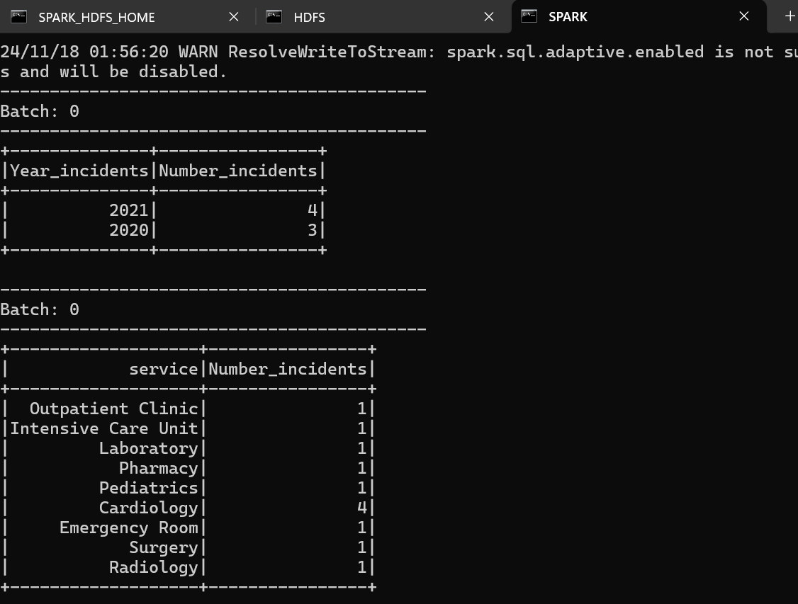


### Put incident_2.csv file within incidents dir
 
in `namenode` command line again we run:

```shell
hdfs dfs -put ./shared/incident_2.csv /incidents
```

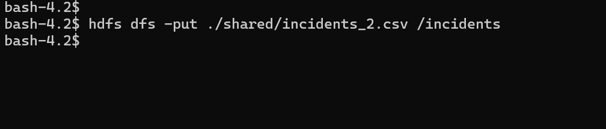

from `spark-master console`:

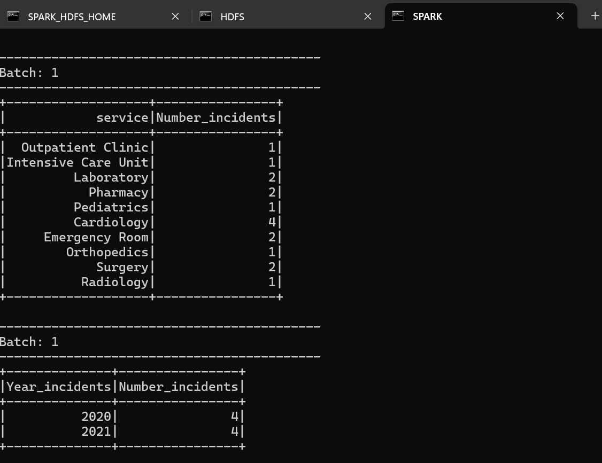


### Put incident_3.csv file within incidents dir

in `namenode` command line again we run:

```shell
hdfs dfs -put ./shared/incident_3.csv /incidents
```

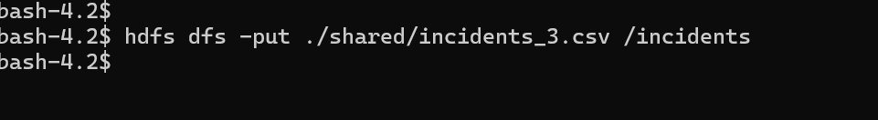

from `spark-master console`:

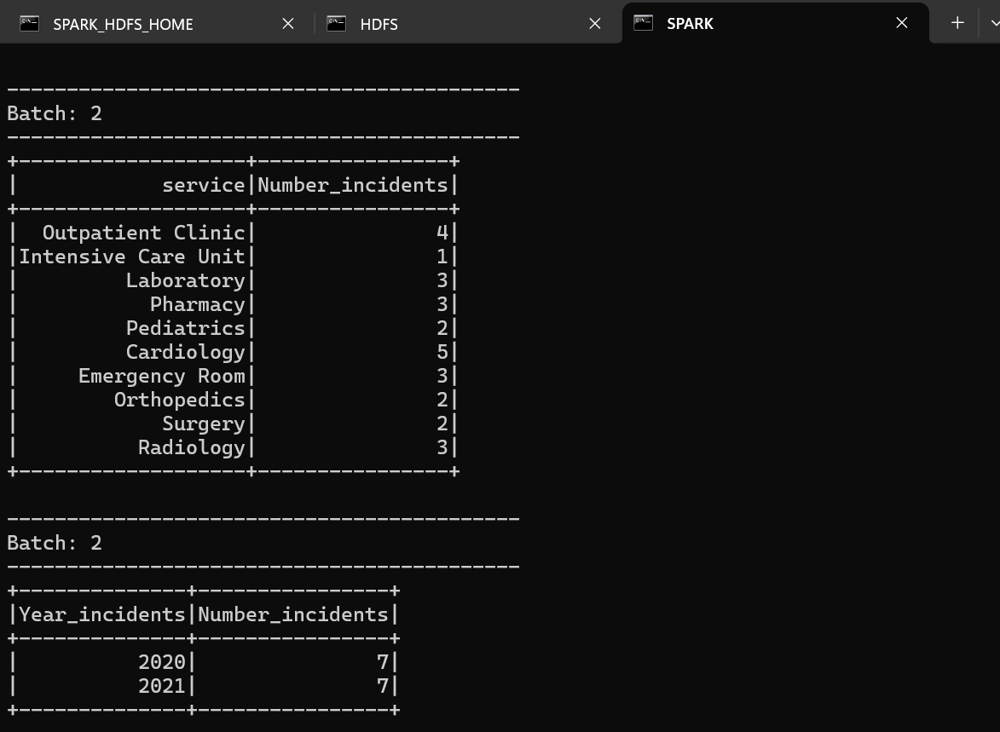